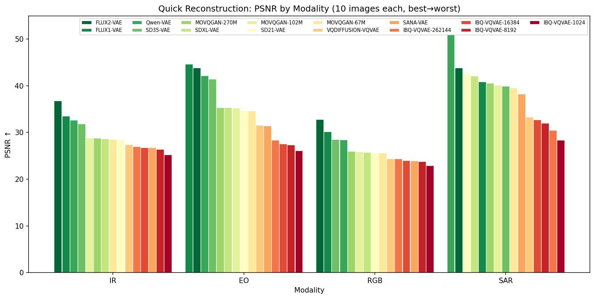
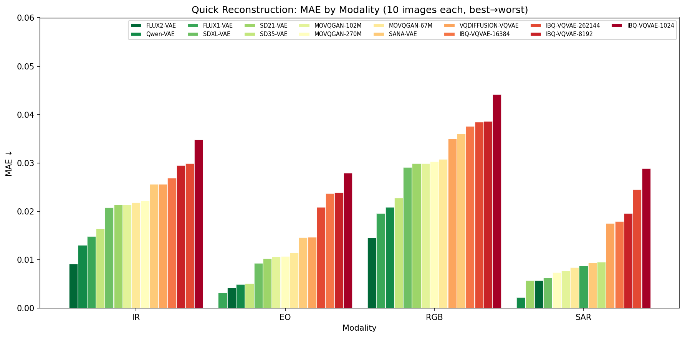
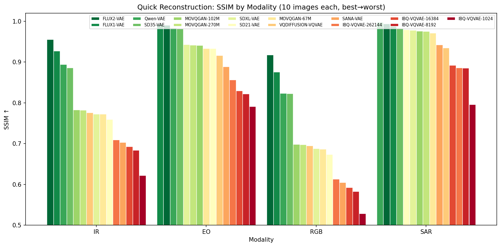

# VAEs4RS

**The Robustness of Natural Image Priors in Remote Sensing: A Zero-Shot VAE Study**

Accepted at the **ICLR 2026 Machine Learning for Remote Sensing (ML4RS) Workshop** (Tiny Paper Track).  
OpenReview: https://openreview.net/forum?id=63yoOFB24h

Are pre-trained VAEs good zero-shot remote sensing image reconstructors?

This repository evaluates variational autoencoders (VAEs) pre-trained on natural image datasets when applied to remote sensing data in a zero-shot manner.

## Results and Findings


*Columns: Ground Truth \| SD21-VAE \| SDXL-VAE \| SD35-VAE \| FLUX1-VAE \| FLUX2-VAE \| SANA-VAE \| Qwen-VAE*  
*Rows: 8 samples (RESISC45 \| All)*

### Quantitative Results

**RESISC45 & AID** (full datasets, original sizes: 256×256 / 600×600)

| Model | GFLOPs | Spatial Comp. | Latent Ch. | PSNR↑ RESISC45 | PSNR↑ AID | SSIM↑ RESISC45 | SSIM↑ AID | LPIPS↓ RESISC45 | LPIPS↓ AID | FID↓ RESISC45 | FID↓ AID |
|-------|--------|---------------|------------|----------------|-----------|----------------|-----------|-----------------|------------|---------------|----------|
| SANA-VAE | 846.76 | 32 | 32 | 23.36 | 24.72 | 0.558 | 0.606 | 0.124 | 0.123 | 8.69 | 5.01 |
| SD21-VAE | 894.91 | 8 | 4 | 25.71 | 26.66 | 0.672 | 0.709 | 0.095 | 0.094 | 4.13 | 3.08 |
| SDXL-VAE | 894.91 | 8 | 4 | 25.83 | 26.80 | 0.692 | 0.726 | 0.098 | 0.098 | 4.98 | 3.11 |
| SD35-VAE | 895.25 | 8 | 16 | 29.71 | 30.72 | 0.862 | 0.876 | 0.035 | 0.037 | 1.11 | 0.69 |
| FLUX1-VAE | 895.25 | 8 | 16 | 33.30 | 33.63 | 0.923 | 0.918 | 0.022 | 0.025 | **0.38** | **0.26** |
| Qwen-VAE | 1143.88 | 8 | 16 | 30.38 | 31.46 | 0.874 | 0.889 | 0.080 | 0.077 | 9.51 | 0.42 |
| FLUX2-VAE | 895.71 | 8 | 32 | **33.42** | **34.46** | **0.925** | **0.926** | **0.021** | **0.022** | 0.46 | 0.37 |

**UCMerced** (2.1K images, 256×256)

| Model | GFLOPs | Spatial Comp. | Latent Ch. | PSNR↑ | SSIM↑ | LPIPS↓ | FID↓ | CMMD↓ |
|-------|--------|---------------|------------|-------|-------|--------|------|-------|
| SANA-VAE | 846.76 | 32 | 32 | 22.33 | 0.564 | 0.112 | 28.64 | 0.0002 |
| SD21-VAE | 894.91 | 8 | 4 | 25.81 | 0.688 | 0.082 | 16.43 | 0.0172 |
| SDXL-VAE | 894.91 | 8 | 4 | 25.92 | 0.705 | 0.084 | 15.97 | 0.0203 |
| SD35-VAE | 895.25 | 8 | 16 | 30.06 | 0.858 | 0.030 | 6.85 | 0.0001 |
| FLUX1-VAE | 895.25 | 8 | 16 | 31.73 | 0.899 | 0.020 | **5.19** | 0.0010 |
| Qwen-VAE | 1143.88 | 8 | 16 | 30.76 | 0.873 | 0.064 | 15.83 | 0.0106 |
| FLUX2-VAE | 895.71 | 8 | 32 | **32.16** | **0.901** | **0.019** | 4.23 | **0.0001** |

**Quick reconstruction** (10 images per modality, single-channel expansion)





<!--
| Data | Model | MAE↓ | PSNR↑ | SSIM↑ |
|------|-------|------|-------|-------|
| IR | SD21-VAE | 0.0213 | 28.49 | 0.7594 |
| IR | SDXL-VAE | 0.0208 | 28.68 | 0.7722 |
| IR | SD35-VAE | 0.0164 | 31.83 | 0.8858 |
| IR | FLUX1-VAE | 0.0148 | 33.53 | 0.9266 |
| IR | FLUX2-VAE | **0.0091** | **36.80** | **0.9548** |
| IR | SANA-VAE | 0.0256 | 26.73 | 0.7027 |
| IR | Qwen-VAE | 0.0130 | 32.67 | 0.8938 |
| IR | MOVQGAN-67M | 0.0218 | 28.50 | 0.7720 |
| IR | MOVQGAN-102M | 0.0213 | 28.82 | 0.7825 |
| IR | MOVQGAN-270M | 0.0222 | 28.81 | 0.7819 |
| IR | VQDIFFUSION-VQVAE | 0.0256 | 27.40 | 0.7754 |
| IR | IBQ-VQVAE-1024 | 0.0348 | 25.25 | 0.6218 |
| IR | IBQ-VQVAE-8192 | 0.0295 | 26.39 | 0.6836 |
| IR | IBQ-VQVAE-16384 | 0.0269 | 26.75 | 0.6927 |
| IR | IBQ-VQVAE-262144 | 0.0299 | 26.96 | 0.7089 |
| EO | SD21-VAE | 0.0102 | 34.69 | 0.9331 |
| EO | SDXL-VAE | 0.0093 | 35.30 | 0.9428 |
| EO | SD35-VAE | 0.0051 | 41.45 | 0.9810 |
| EO | FLUX1-VAE | **0.0032** | **44.64** | **0.9930** |
| EO | FLUX2-VAE | 0.0042 | 43.83 | 0.9903 |
| EO | SANA-VAE | 0.0146 | 31.43 | 0.8885 |
| EO | Qwen-VAE | 0.0049 | 42.17 | 0.9833 |
| EO | MOVQGAN-67M | 0.0114 | 34.64 | 0.9333 |
| EO | MOVQGAN-102M | 0.0106 | 35.26 | 0.9404 |
| EO | MOVQGAN-270M | 0.0107 | 35.31 | 0.9413 |
| EO | VQDIFFUSION-VQVAE | 0.0147 | 31.56 | 0.9161 |
| EO | IBQ-VQVAE-1024 | 0.0279 | 26.09 | 0.7905 |
| EO | IBQ-VQVAE-8192 | 0.0239 | 27.36 | 0.8217 |
| EO | IBQ-VQVAE-16384 | 0.0237 | 27.56 | 0.8291 |
| EO | IBQ-VQVAE-262144 | 0.0209 | 28.33 | 0.8559 |
| RGB | SD21-VAE | 0.0299 | 25.64 | 0.6732 |
| RGB | SDXL-VAE | 0.0291 | 25.73 | 0.6880 |
| RGB | SD35-VAE | 0.0228 | 28.50 | 0.8221 |
| RGB | FLUX1-VAE | 0.0196 | 30.21 | 0.8753 |
| RGB | FLUX2-VAE | **0.0145** | **32.76** | **0.9173** |
| RGB | SANA-VAE | 0.0360 | 23.94 | 0.6047 |
| RGB | Qwen-VAE | 0.0209 | 28.45 | 0.8231 |
| RGB | MOVQGAN-67M | 0.0308 | 25.62 | 0.6863 |
| RGB | MOVQGAN-102M | 0.0299 | 25.89 | 0.6980 |
| RGB | MOVQGAN-270M | 0.0303 | 25.96 | 0.6975 |
| RGB | VQDIFFUSION-VQVAE | 0.0350 | 24.38 | 0.6949 |
| RGB | IBQ-VQVAE-1024 | 0.0442 | 22.93 | 0.5285 |
| RGB | IBQ-VQVAE-8192 | 0.0386 | 23.80 | 0.5828 |
| RGB | IBQ-VQVAE-16384 | 0.0376 | 24.02 | 0.5920 |
| RGB | IBQ-VQVAE-262144 | 0.0385 | 24.35 | 0.6126 |
| SAR | SD21-VAE | 0.0057 | 42.68 | 0.9789 |
| SAR | SDXL-VAE | 0.0063 | 42.10 | 0.9778 |
| SAR | SD35-VAE | 0.0095 | 39.95 | 0.9823 |
| SAR | FLUX1-VAE | 0.0087 | 40.83 | 0.9904 |
| SAR | FLUX2-VAE | 0.0057 | 43.84 | 0.9938 |
| SAR | SANA-VAE | 0.0094 | 38.27 | 0.9419 |
| SAR | Qwen-VAE | **0.0022** | **51.04** | **0.9967** |
| SAR | MOVQGAN-67M | 0.0084 | 39.56 | 0.9709 |
| SAR | MOVQGAN-102M | 0.0077 | 40.17 | 0.9758 |
| SAR | MOVQGAN-270M | 0.0074 | 40.57 | 0.9748 |
| SAR | VQDIFFUSION-VQVAE | 0.0175 | 33.28 | 0.9346 |
| SAR | IBQ-VQVAE-1024 | 0.0289 | 28.38 | 0.7957 |
| SAR | IBQ-VQVAE-8192 | 0.0196 | 31.97 | 0.8851 |
| SAR | IBQ-VQVAE-16384 | 0.0179 | 32.69 | 0.8915 |
| SAR | IBQ-VQVAE-262144 | 0.0245 | 30.47 | 0.8855 |
-->

## Insights and Conclusion

**Insights 1:** We find that VAEs reconstruct remote sensing images remarkably well, with reconstructions appearing visually nearly identical to the input. We argue that VAEs may have the potential to implicitly deblur and denoise input images, where the reconstructed image serves as a better data source for model training (e.g., representation learning) with possibly improved statistics.

**Insights 2:** As the compression appears effectively lossless, we argue for directly storing latent representations instead of original images as datasets to reduce storage requirements.

In this work, we explored the robustness of natural image priors in VAEs for remote sensing. Our findings indicate that these models, when used zero-shot, can provide significant utility in data compression across various categories. We will release the reconstructed images along with their corresponding latents for community exploration and further research.

## Quick Start

For code usage, installation, and detailed documentation, see [src/README.md](src/README.md).

### Training

Fine-tune any VAE on remote sensing images:

```bash
# Single-channel RS (IR, SAR, EO) with SD-VAE
python scripts/train_vae.py --config configs/train_rs_vae.yaml

# Any VAE with generic config
python scripts/train_vae.py --config configs/train_vae.yaml

# Multi-GPU training
accelerate launch scripts/train_vae.py --config configs/train_vae.yaml

# Override settings via CLI
python scripts/train_vae.py --config configs/train_vae.yaml \
    --pretrained_path stabilityai/sd-vae-ft-mse \
    --train_dir datasets/rs/train \
    --num_epochs 50
```

### Evaluation

```bash
python scripts/run_experiments.py              # Run main evaluation
python scripts/run_experiments.py --ablation   # Run ablation study
python scripts/run_experiments.py --visualize  # Generate visualizations

# Quick single-image reconstruction sanity check (1-channel SAR/IR/EO)
python scripts/quick_vae_reconstruction.py --input-dir /path/to/images \
    --vae-path ./models/BiliSakura/VAEs --resolution 512 --output-dir ./outputs
```

### Interactive Viewer

```bash
streamlit run scripts/streamlit_app.py
```

**Resources:**
- VAE Models: [https://huggingface.co/BiliSakura/VAEs](https://huggingface.co/BiliSakura/VAEs)
- Datasets: [https://huggingface.co/blanchon/AID](https://huggingface.co/blanchon/AID) and [https://huggingface.co/blanchon/RESISC45](https://huggingface.co/blanchon/RESISC45)
- Latents Dataset (FLUX2-VAE): [https://huggingface.co/datasets/BiliSakura/RS-Dataset-Latents](https://huggingface.co/datasets/BiliSakura/RS-Dataset-Latents) - Latents version of AID and RESISC45 using FLUX2-VAE

## Citation

If you find this work useful, please cite:

```bibtex
@inproceedings{chen2026robustness,
  author = {Zhenyuan Chen and Feng Zhang},
  title = {THE ROBUSTNESS OF NATURAL IMAGE PRIORS IN REMOTE SENSING: A ZERO-SHOT VAE STUDY},
  booktitle = {ICLR 2026 Machine Learning for Remote Sensing (ML4RS) Workshop},
  year = {2026},
  url = {https://openreview.net/forum?id=63yoOFB24h}
}
```
